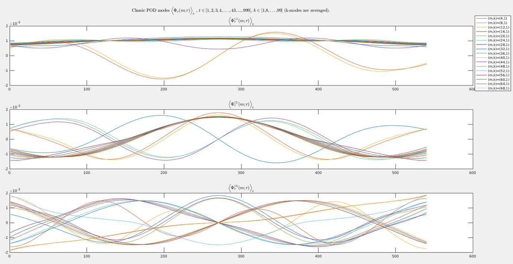
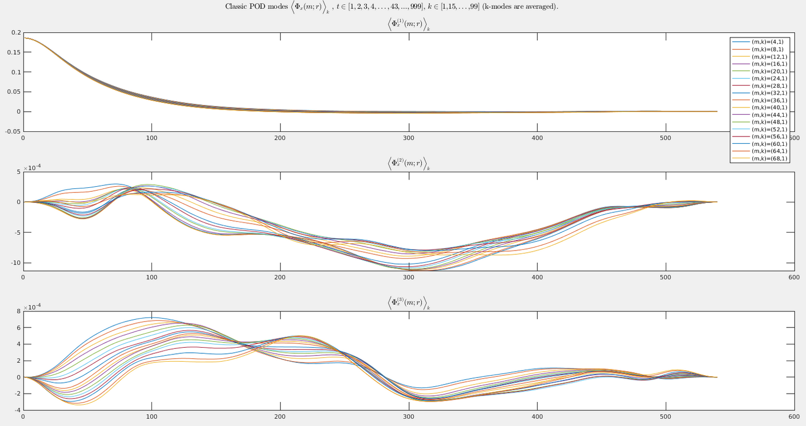
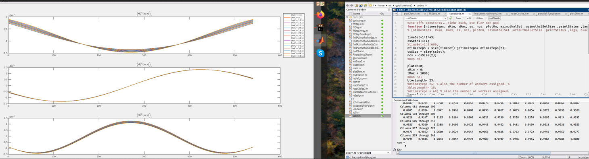

# Changes &lt;2022-06-05 Sun&gt;

## fft(theta)->rcorr-> fft(x)

-   Results of different runs. Note, code modified for different run
    -   $k\in [1,8,16,\ldots, 99]$  here. Important is that, the end points are included.
        -   shows very geometrical.
        -   used fft for $\theta$ - fourier coefficients not used.

## fourier(theta)->rcorr-> fft(x)

-   shows $k\in[1,15,\ldots , 99]$. So fewer than above.
-   fourier coefficients.
    

## 1 crosssection

-   nb 989 timesteps used because nts=43 buit blocLength=23 $\Rightarrow$  total = 989.

# Changes &lt;2022-06-04 Sat&gt;

-   status on whole procedure:
    -   getting smooth end-of spectral function.
        However the fucntion is not zero at the endpoints $r=0$ and $r=R$. So looking at different functions of the procedure and changing obvious mistakes. One of which is:
-   add fourier function. Fourier, not fft, needs to be done.

# Changes &lt;2022-06-01 Wed&gt;

-   finish classic pod
    -   form symmetric correlation in $r,r'$.

